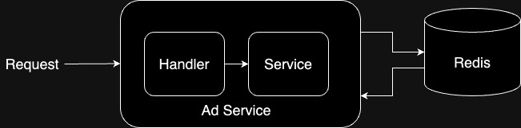

# Design Document
The project is using Gin framework for backend service and Redis for data storage.
## Go-Gin Framework
For the web framework, we have chosen Gin-Gonic, a high-performance HTTP web framework for Go (Golang).

### Rationale
- **Performance:** Gin is known for its high performance. It is built on top of httprouter, allowing it to handle requests faster than many other web frameworks, which is crucial for achieving the goal of handling 10,000 requests per second (PRS).
- **Ease of Use:** Gin offers a robust set of features while maintaining simplicity, making it easy to develop and maintain code.
- **Community and Documentation:** Gin has a large community and extensive documentation, ensuring support for a wide range of use cases and easy resolution of potential issues.

## Redis
Redis is chosen as the primary data store for caching and quickly retrieving advertisement data.

### Rationale
- **Performance:** Redis's in-memory data store offers low latency and high throughput, ideal for caching and operations requiring quick data access. It's also easier to reach the goal to handle 10000 PRS.
- **Persistence:** While primarily an in-memory store, Redis offers options for data persistence, ensuring that data is not lost between restarts.

## High-Level Architecture
```
├─ app
│   ├─ main.go
│   ├─ handler.go
│   ├─ model.go
│   ├─ service.go
│   └─ service_test.go
│
├─ conf
│   └─ redis.conf
│
├─ Dockerfile
├─ docker-compose.yml
├─ go.mod
└─ go.sum
```
1. **Controller:** The `handler.go` basically is the controller to handle the imcoming request and to return the response to client.
2. **Service:** The services provide the fundamental function to process the data. The service in this project is `service.go`.
3. **Model:** The model indicates the data structure to be used for storage and retrieval.

**Others:**  
1. Since there are only two APIs in the project, the file has not been well structured.
2. The unit tests might not cover all the scenarios.
3. The best practice for API demo is using swagger.

**Diagram**  
  

## APIs
- **POST** `/api/v1/ad`  
    **payload example:**
    ```json
    {
        "title": "AD 45",
        "startAt": "2023-12-10T03:00:00.000Z", 
        "endAt": "2023-12-31T16:00:00.000Z", 
        "conditions": {
            "ageStart": 15,
            "ageEnd": 30,
            "country": ["JP", "KR"], 
            "platform": ["web"]
        }
    }
    ```
- **GET** `/api/v1/ad`
    ```
    /api/v1/ad?offset=10&limit=3&age=24&gender=F&country=TW&platform=ios
    ```
    **Response Example:**
    ```json
    {
        "items": [ 
        {
            "title": "AD 1",
            "endAt": "2023-12-22T01:00:00.000Z"
        }, {
            "title": "AD 31",
            "endAt": "2023-12-30T12:00:00.000Z"
        },
    }
    ```

## Git flow and CI/CD
  
In this project, I used GitHub Actions for CI/CD. Both unit tests and the Docker image have been integrated into the pipeline. Essentially, this follows a simple Git flow with only one long-lived branch, which is `master`. Whenever a pull request is made, the pipeline is triggered to check whether the image can be built successfully and whether the tests pass.