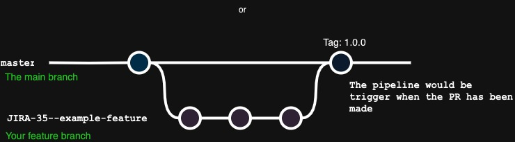

# 設計文件
在 Dacard 作業使用 Gin 框架作為後端服務，並使用 Redis 作為資料庫。

## Go-Gin 框架
在作業中我選擇了效能比較好的 HTTP 框架 Gin-Gonic。

### 理由
- Go-Gin 的效能比較好。它是基於 httprouter 構建的，可以比其他框架快，有機會達到每秒處理 10,000 個請求的目標。
- Gin 除了高效能以外，同時使用上比較方便，讓開發和維護程式碼變得容易。
- Gin 擁有龐大的使用群眾，所以能比較容易找到資源來解決開方上的問題。

## Redis 資料庫
選擇 Redis 作為主要的資料庫，是因為可以快速存取廣告資料。

### 理由
- Redis 通常將全部的資料儲存在記憶體中，所以能提供了低延遲和高吞吐量，能達到快速存取數據需求。這也使達到每秒處理 10,000 個請求的目標變得更加容易。
- 雖然 Redis 主要要將資料存在記憶體中，但 Redis 也提供了將資料存在硬碟選擇，可以確保資料在服務的重啟之間不會丟失。

## 作業架構
```
├─ app
│   ├─ main.go
│   ├─ handler.go
│   ├─ model.go
│   ├─ service.go
│   └─ service_test.go
│
├─ conf
│   └─ redis.conf
│
├─ Dockerfile
├─ docker-compose.yml
├─ go.mod
└─ go.sum
```

1. **控制器(Controller)：** `handler.go` 基本上是處理傳入請求並向客戶端返回響應的控制器。
2. **服務(Service)：** 服務提供處理資料的基本功能，例如篩選。這個作業中的服務是指 service.go。
3. **模型(Model)：** 模型指的是用於從資料庫存儲和檢索的資料結構。

**其他：**  
1. 如果之後 API 請求量增大可以使用 k8s replica 來處理，但須注意 race conditions。
2. 由於項目中只有兩個 API，資料結構沒有像其專案有很好的分類。
3. 單元測試可能未涵蓋所有情境。
4. 可以整合 Swagger 更好的呈現 API。

**Diagram**  
  

## APIs
- **POST** `/api/v1/ad`  
    **Payload example:**
    ```json
    {
        "title": "AD 45",
        "startAt": "2023-12-10T03:00:00.000Z", 
        "endAt": "2023-12-31T16:00:00.000Z", 
        "conditions": {
            "ageStart": 15,
            "ageEnd": 30,
            "country": ["JP", "KR"], 
            "platform": ["web"]
        }
    }
    ```
- **GET** `/api/v1/ad`  
    **Request Example:**
    ```
    /api/v1/ad?offset=10&limit=3&age=24&gender=F&country=TW&platform=ios
    ```
    **Response Example:**
    ```json
    {
        "items": [ 
            {
                "title": "AD 1",
                "endAt": "2023-12-22T01:00:00.000Z"
            }, 
            {
                "title": "AD 31",
                "endAt": "2023-12-30T12:00:00.000Z"
            },
        ]
    }
    ```

## Git flow 及 CI/CD
  
在這個專案中，我使用了 GitHub Actions 進行 CI/CD。單元測試和建立 Docker 映像都已經整合到 CI/CD 的流程中。基本上這是一個簡單的 Git 流程，這裡只有一個長期存在的分支，那就是 master。每當有 PR（pull request）被提出時，CI/CD 的流程就會被觸發，來檢查 Docker 映像是否能夠成功建立以及測試是否通過。